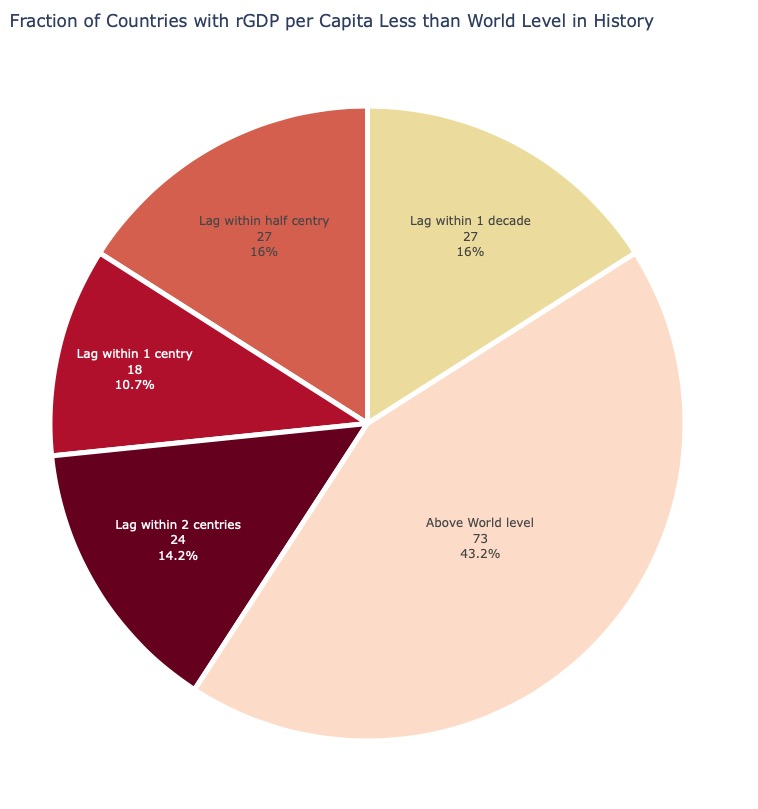

###### For the publishing site, please visit:[https://ken011001.github.io/data-visualization/](https://ken011001.github.io/Inequality-and-Economic-Growth/)

# World Long Term Economic Growth

By using cross country panel data from *World Bank*, *Penn World Table* and *Madison Project*, I have constructed the animated graphs and maps for the  across countries long term economic growth and inequality data:

#### [World Historical rGDP per Capita Ranking - AD0001 to AD2018](https://ken011001.github.io/Inequality-and-Economic-Growth/html/rGDP%20per%20Capita%20Ranking_MPD2.html)

#### [World rGDP per Capita Ranking - Top 10 Countries/Regions](https://ken011001.github.io/Inequality-and-Economic-Growth/html/rGDP%20per%20Capita%20Ladder.html)

#### [World rGDP per Capita Line Chart](https://ken011001.github.io/Inequality-and-Economic-Growth/html/rGDP%20per%20Capita%20Line%20MPD.html)

#### [rGDP per Captia vs Human Capital Index](https://ken011001.github.io/Inequality-and-Economic-Growth/html/PWT.html)

#### [rGDP per Captia vs rGDP Growth](https://ken011001.github.io/Inequality-and-Economic-Growth/html/PWT%20rGDP%20Growth.html)

#### [rGDP per Captia vs Population Growth](https://ken011001.github.io/Inequality-and-Economic-Growth/html/PWT%20Pop%20Growth.html)

#### [rGDP per Captia Heat Map](https://ken011001.github.io/Inequality-and-Economic-Growth/html/Global%20rGDP%20per%20Capita%20Heat%20Map.html)

#### [Global Population Dot Map](https://ken011001.github.io/Inequality-and-Economic-Growth/html/Global%20Pop%20Map.html)

###### Source of Data:
######  *Feenstra, Robert C., Robert Inklaar and Marcel P. Timmer (2015), "The Next Generation of the Penn World Table" American Economic Review, 105(10), 3150-3182, available for download at www.ggdc.net/pwt*
###### *Bolt, Jutta and Jan Luiten van Zanden (2020), Maddison Project Database, version 2020., “Maddison style estimates of the evolution of the world economy. A new 2020 update”*
###### *World Bank. World Development Indicators, The World Bank Group, 2020, databank.worldbank.org/source/world-development-indicators/*

# US Recession Prediction
#### [US Recession Indicators](https://research.stlouisfed.org/dashboard/48606)

###### Source of Data: 
###### *FRED@St.Louis*

