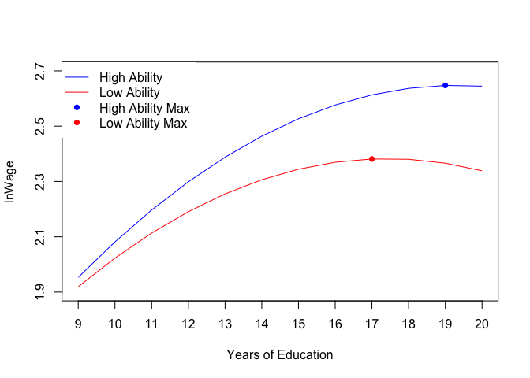

US Recession Probability
================
February 20, 2020

<!-- -->

As we can read from the graph, people with high ability would in general
have higher wage than those with low ability. The wage profile line for
low ability is more concave than that for high ability which means the
(absolute) marginal value of addtional year of education for the high
ability people is higher than that for the low ability people for all
years of education. Also the maximum wage for high ability people
happens older than that for low ability people.
